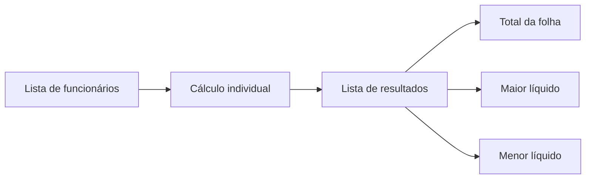

# Projeto 4

## Cálculo de Folha de Pagamento

Comparação entre paradigmas: **imperativo**, **orientado a objetos**, **funcional** e **lógico**

<div class="mt-10 text-sm opacity-80">
UESPI · Paradigmas de Linguagens de Programação · 2026.1
</div>

<div class="absolute bottom-10 left-0 right-0 text-center text-sm opacity-70">
Integrantes: Filipe Genesis | 
		 Alex Soares | 
		 Francisco Luan
</div>

---
layout: section
---

# O problema

Implementar o mesmo cálculo sob quatro formas de pensar

---

# Objetivo do sistema

<div class="grid grid-cols-2 gap-8 mt-8">
<div>

## Entrada

- Nome do funcionário
- Salário bruto
- Número de dependentes
- Horas extras

</div>
<div>

## Saída

- Valor das horas extras
- INSS
- IRRF
- Salário líquido
- Total, maior e menor líquido

</div>
</div>

<div class="mt-10 p-4 rounded bg-blue-50 text-blue-900">
O foco do trabalho não é apenas calcular corretamente, mas comparar como cada paradigma organiza regras, dados e agregações.
</div>

---

# Regras principais

<div class="grid grid-cols-2 gap-6 text-sm mt-4">
<div>

## Fórmulas

```txt
valor_hora = salário_bruto / 180
extras = valor_hora × 1,5 × horas
base_irrf = bruto + extras - INSS - dependentes×189,59
líquido = bruto + extras - INSS - IRRF
```

</div>
<div>

## Faixas simplificadas

| Imposto | Faixas usadas |
|---|---|
| INSS | 7,5%, 9%, 12%, 14% |
| IRRF | isento, 7,5%, 15%, 22,5%, 27,5% |

</div>
</div>

<div class="mt-8 text-sm opacity-80">
Premissa: as quatro linguagens usam as mesmas tabelas e só formatam valores monetários com 2 casas na saída.
</div>

---

# Caso de teste obrigatório

| Funcionário | Bruto | Extras | INSS | IRRF | Líquido |
|---|---:|---:|---:|---:|---:|
| Ana | 4500.00 | 300.00 | 630.00 | 852.93 | 3317.07 |
| Bruno | 2200.00 | 0.00 | 198.00 | 0.00 | 2002.00 |
| Carla | 1300.00 | 43.33 | 97.50 | 0.00 | 1245.83 |

<div class="grid grid-cols-3 gap-4 mt-8 text-center">
<div class="p-4 rounded bg-green-50">
<div class="text-xs opacity-70">Total da folha</div>
<div class="text-2xl font-bold">6564.90</div>
</div>
<div class="p-4 rounded bg-blue-50">
<div class="text-xs opacity-70">Maior líquido</div>
<div class="text-2xl font-bold">Ana</div>
</div>
<div class="p-4 rounded bg-orange-50">
<div class="text-xs opacity-70">Menor líquido</div>
<div class="text-2xl font-bold">Carla</div>
</div>
</div>

---
layout: section
---

# Quatro paradigmas

A mesma regra, quatro arquiteturas diferentes

---

# Visão geral das soluções

| Paradigma | Linguagem | Ideia central | LOC |
|---|---|---|---:|
| Imperativo | C | structs, arrays, loops e acumuladores | 85 |
| Orientado a objetos | Java | entidades, estratégias e encapsulamento | 102 |
| Funcional | Haskell | funções puras e transformação de listas | 87 |
| Lógico | Prolog | fatos, regras e relações | 71 |

<div class="mt-8 p-4 rounded bg-gray-100 text-sm">
LOC = linhas não vazias e não comentadas da implementação principal.
</div>

---

# Imperativo — C

<div class="grid grid-cols-2 gap-6">
<div>

### Como pensa o problema

- Dados em `structs`
- Faixas em arrays
- Busca por alíquota com `for`
- Agregados com acumuladores

### Ponto forte

Fluxo explícito e fácil de depurar passo a passo.

### Fricção

Mais responsabilidade manual sobre índices, arrays e mutação.

</div>
<div>

```c
static double buscar_aliquota(double valor,
                              const Faixa faixas[],
                              size_t quantidade) {
    for (size_t i = 0; i < quantidade; i++) {
        if (valor <= faixas[i].limite)
            return faixas[i].aliquota;
    }
    return faixas[quantidade - 1].aliquota;
}

for (size_t i = 0; i < quantidade; i++) {
    Resultado atual = calcular_funcionario(
        &funcionarios[i]);
    total += atual.liquido;
}
```

</div>
</div>

---

# Orientado a objetos — Java

<div class="grid grid-cols-2 gap-6">
<div>

### Como pensa o problema

- `Funcionario` e `ResultadoFolha`
- `Faixa` como objeto de domínio
- `RegraDesconto` como Strategy
- `CalculadoraFolha` coordena o cálculo

### Ponto forte

Boa extensibilidade quando regras mudam.

### Fricção

Mais estrutura do que o problema mínimo exige.

</div>
<div>

```java
interface RegraDesconto {
    double calcular(double base);
}

class RegraPorFaixas implements RegraDesconto {
    public double calcular(double base) {
        double aliquota = faixas.stream()
            .filter(f -> f.contem(base))
            .findFirst()
            .orElseThrow()
            .aliquota();
        return base * aliquota;
    }
}
```

</div>
</div>

---

# Funcional — Haskell

<div class="grid grid-cols-2 gap-6">
<div>

### Como pensa o problema

- Dados imutáveis
- Funções puras
- `map` transforma funcionários em resultados
- `sum`, `maximumBy`, `minimumBy` calculam agregados

### Ponto forte

O domínio é naturalmente uma transformação de lista.

### Fricção

Exige pensar em composição, não em atualização de variáveis.

</div>
<div>

```haskell
aliquota [] _ = error "Tabela de faixas vazia"
aliquota ((limite, taxa):resto) valor
    | valor <= limite = taxa
    | otherwise = aliquota resto valor

calcularFuncionario f =
    ResultadoFolha nome bruto extras inss irrf liquido
  where
    bruto = salarioBruto f
    extras = valorExtras f
    inss = bruto * aliquota faixasINSS bruto
    base = max 0.0
        (bruto + extras - inss - deducaoDependentes f)
    irrf = base * aliquota faixasIRRF base
    liquido = bruto + extras - inss - irrf
```

</div>
</div>

---

# Lógico — Prolog

<div class="grid grid-cols-2 gap-6">
<div>

### Como pensa o problema

- Faixas como fatos
- Cálculos como predicados
- `folha/2` relaciona lista de entrada e resultados
- Sem estado mutável simulado

### Ponto forte

Regras de faixas ficam declarativas e compactas.

### Fricção

Aritmética depende de instanciação e ordem dos predicados.

</div>
<div>

```prolog
faixa_inss(1412.00, 0.075).
faixa_inss(2666.00, 0.090).
faixa_inss(4000.00, 0.120).
faixa_inss(infinito, 0.140).

aliquota(Tipo, Valor, Aliquota) :-
    faixa(Tipo, Limite, Aliquota),
    dentro_da_faixa(Valor, Limite),
    !.

folha(Funcionarios, Resultados) :-
    maplist(calcular_funcionario,
            Funcionarios,
            Resultados).
```

</div>
</div>

---
layout: section
---

# Comparação

O que mudou ao trocar o paradigma?

---

# Representação das faixas

<div class="grid grid-cols-4 gap-3 text-center text-sm mt-6">
<div class="p-4 rounded bg-red-50">
<div class="font-bold text-lg">C</div>
Arrays de `Faixa`
</div>
<div class="p-4 rounded bg-blue-50">
<div class="font-bold text-lg">Java</div>
Objetos `Faixa` dentro de estratégias
</div>
<div class="p-4 rounded bg-purple-50">
<div class="font-bold text-lg">Haskell</div>
Listas de pares `(limite, taxa)`
</div>
<div class="p-4 rounded bg-green-50">
<div class="font-bold text-lg">Prolog</div>
Fatos `faixa_inss/2` e `faixa_irrf/2`
</div>
</div>

<div class="mt-10">

## Insight

Adicionar uma nova faixa é simples em todas as versões, mas o impacto arquitetural é diferente: em Java a alteração fica encapsulada na estratégia; em Prolog vira um novo fato; em C e Haskell é uma nova entrada na tabela.

</div>

---

# Estado e processamento da lista



<div class="grid grid-cols-2 gap-6 mt-6 text-sm">
<div>

## Mutação explícita

- C usa acumuladores durante o loop
- Fácil acompanhar, mas exige disciplina

</div>
<div>

## Transformação declarativa

- Haskell e Prolog separam cálculo individual e agregação
- Java usa streams para aproximar essa ideia

</div>
</div>

---

# O que cada paradigma evidenciou

| Paradigma | Onde brilhou | Onde trouxe fricção |
|---|---|---|
| C | Controle direto do fluxo | Controle manual de estado |
| Java | Extensibilidade e encapsulamento | Verbosidade estrutural |
| Haskell | Cálculo puro e agregações | Curva de aprendizado funcional |
| Prolog | Regras compactas e declarativas | Aritmética não é tão natural |

<div class="mt-8 p-4 rounded bg-yellow-50 text-sm">
A solução mais curta não foi automaticamente a mais simples: Prolog teve menos LOC, mas exige familiaridade com unificação, corte e avaliação aritmética.
</div>

---

# Resultados de execução

Todas as implementações produziram valores equivalentes.

```txt
Total da folha: 6564.90
Maior salário líquido: Ana (3317.07)
Menor salário líquido: Carla (1245.83)
```

<div class="grid grid-cols-4 gap-4 mt-8 text-center">
<div class="ok">C<br><span>OK</span></div>
<div class="ok">Java<br><span>OK</span></div>
<div class="ok">Haskell<br><span>OK</span></div>
<div class="ok">Prolog<br><span>OK</span></div>
</div>

<style>
.ok {
  padding: 1rem;
  border-radius: 0.75rem;
  background: #ecfdf5;
  color: #065f46;
  font-weight: 700;
}
.ok span {
  font-size: 1.7rem;
}
</style>

---
layout: section
---

# Conclusão

Não existe paradigma universalmente melhor — existe adequação ao problema

---

# Síntese final

<div class="grid grid-cols-2 gap-8 mt-4">
<div>

## Para este domínio

O paradigma **funcional** ficou especialmente adequado porque o problema é uma transformação de dados:

```txt
funcionários → resultados → agregados
```

</div>
<div>

## Para evolução futura

A abordagem **orientada a objetos** seria vantajosa se novas regras, categorias ou políticas de desconto surgissem com frequência.

</div>
</div>

<div class="mt-10 p-5 rounded bg-blue-50 text-blue-900">
O exercício mostrou que trocar de paradigma muda mais do que a sintaxe: muda a arquitetura, o controle de estado e a forma de justificar decisões técnicas.
</div>

---
layout: end
---

# Obrigado!

## Perguntas?

<div class="mt-10 text-sm opacity-75">
Projeto 4 — Cálculo de Folha de Pagamento<br>
Paradigmas de Linguagens de Programação
</div>
